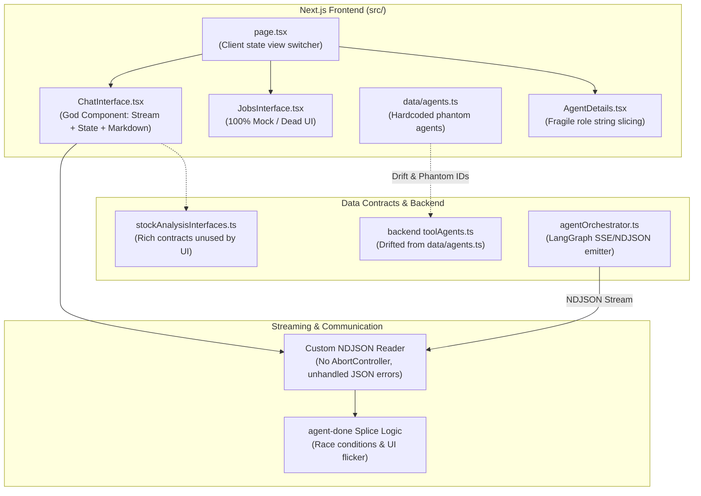

# LLM Frontend Technical Debt Analysis

## 1. Executive Summary

This document provides a comprehensive technical debt assessment of the **LLM Frontend** within the `agent-platform` codebase. It identifies key architectural bottlenecks, streaming communication vulnerabilities, data contract drifts, performance risks, and UX deficiencies, paired with an actionable 3-phase remediation roadmap.

---

## 2. Actionable Implementation Tables

### Phase 1: Stabilization & Bug Fixes (Immediate)

| Status | ID | Severity | Category | Target Location | Problem Summary | Actionable Implementation Item |
| :---: | :---: | :---: | :--- | :--- | :--- | :--- |
| [ ] | **`TD-01`** | **High** | Streaming | [`ChatInterface.tsx:350-377`](file:///Users/sfuser/develop/work/agent-platform/src/app/components/ChatInterface.tsx#L350-L377) | Unhandled `JSON.parse` crashes stream reader on malformed/split frames | Wrap per-line chunk parsing in `try/catch` with graceful error logging |
| [ ] | **`TD-02`** | **High** | Streaming | [`ChatInterface.tsx:295-403`](file:///Users/sfuser/develop/work/agent-platform/src/app/components/ChatInterface.tsx#L295-L403) | No cancellation mechanism for ongoing LLM inference | Pass `AbortController.signal` to `fetch('/api/chat')` & wire "Stop" UI button |
| [ ] | **`TD-07`** | **High** | Schema | [`data/agents.ts`](file:///Users/sfuser/develop/work/agent-platform/src/app/data/agents.ts) / [`toolAgents.ts`](file:///Users/sfuser/develop/work/agent-platform/backend/agents/toolAgents.ts) | Ghost agents (`calculator`, etc.) and `'getweather'` ID mismatch | Establish SSOT agent registry; remove ghost agents and align IDs |
| [ ] | **`TD-14`** | **Low** | Code Quality | [`AgentsList.tsx:5`](file:///Users/sfuser/develop/work/agent-platform/src/app/components/AgentsList.tsx#L5) / [`ChatInterface.tsx:116`](file:///Users/sfuser/develop/work/agent-platform/src/app/components/ChatInterface.tsx#L116) | Unused variables (`getRole`, `isNearBottom`) trigger ESLint warnings | Remove dead code and unused state variables to ensure clean lint builds |

### Phase 2: Architecture, Modularity & State Management (Short-Term)

| Status | ID | Severity | Category | Target Location | Problem Summary | Actionable Implementation Item |
| :---: | :---: | :---: | :--- | :--- | :--- | :--- |
| [ ] | **`TD-03`** | **Medium** | Streaming | [`ChatInterface.tsx:235-263`](file:///Users/sfuser/develop/work/agent-platform/src/app/components/ChatInterface.tsx#L235-L263) | Positional splicing on `agent-done` causes UI flicker and race conditions | Transition to deterministic task/message IDs for concurrent subagent events |
| [ ] | **`TD-04`** | **High** | Architecture | [`ChatInterface.tsx`](file:///Users/sfuser/develop/work/agent-platform/src/app/components/ChatInterface.tsx) | 625-line God component couples streaming, scroll, session, UI | Extract `useChatStream`, `useAutoScroll`, `useSessionHistory`, and subcomponents |
| [ ] | **`TD-05`** | **Medium** | Architecture | [`src/app/page.tsx:13-33`](file:///Users/sfuser/develop/work/agent-platform/src/app/page.tsx#L13-L33) | `useState<View>` breaks deep linking and browser back/forward buttons | Migrate to Next.js dynamic App Router routes (`/chat`, `/agents`, `/jobs`) |
| [ ] | **`TD-06`** | **High** | Architecture | [`JobsInterface.tsx`](file:///Users/sfuser/develop/work/agent-platform/src/app/components/JobsInterface.tsx) | 100% mock static jobs view disconnected from backend orchestrator | Connect interface to real backend task stream / background job API |
| [ ] | **`TD-08`** | **Medium** | Schema | [`AgentDetails.tsx:11-30`](file:///Users/sfuser/develop/work/agent-platform/src/app/components/AgentDetails.tsx#L11-L30) | `name.split(' ')[0]` heuristic breaks theme styles on multi-word agents | Replace with explicit `theme` or `color` tokens in agent metadata |
| [ ] | **`TD-12`** | **Medium** | Memory | [`ChatInterface.tsx:158-170`](file:///Users/sfuser/develop/work/agent-platform/src/app/components/ChatInterface.tsx#L158-L170) | Single global session key in `localStorage` orphans past chats | Build conversation history sidebar tracking session IDs, titles, and timestamps |

### Phase 3: Generative UI, Performance & Testing (Medium-Term)

| Status | ID | Severity | Category | Target Location | Problem Summary | Actionable Implementation Item |
| :---: | :---: | :---: | :--- | :--- | :--- | :--- |
| [ ] | **`TD-09`** | **High** | Generative UI | [`stockAnalysisInterfaces.ts`](file:///Users/sfuser/develop/work/agent-platform/src/lib/stockAnalysisInterfaces.ts) | Rich structured data contracts discarded in favor of raw markdown text | Build structured UI cards (`<DecisionCard>`, `<RiskGauge>`, `<CosmeticCard>`) |
| [ ] | **`TD-10`** | **Medium** | Performance | [`ChatInterface.tsx:532-581`](file:///Users/sfuser/develop/work/agent-platform/src/app/components/ChatInterface.tsx#L532-L581) | Full Markdown AST re-parsing on every streaming token causes CPU thrashing | Throttle/debounce markdown re-renders (e.g. 50ms interval) during active streams |
| [ ] | **`TD-11`** | **Low** | UX | [`ChatInterface.tsx:543-551`](file:///Users/sfuser/develop/work/agent-platform/src/app/components/ChatInterface.tsx#L543-L551) | Plain code blocks without syntax highlighting or copy-to-clipboard | Integrate Shiki/Prism syntax highlighter and interactive copy button |
| [ ] | **`TD-13`** | **High** | QA | Repository-wide | Zero frontend unit, component, or E2E test coverage | Set up Vitest + React Testing Library + Playwright test suites |

---

## 3. Architectural Overview & System Flow



---

## 4. Deep-Dive Category Analysis

### 4.1 Streaming & Real-Time Protocol Debt

#### 1. Fragile Custom NDJSON Parser without Error Boundaries
- **Location**: [`src/app/components/ChatInterface.tsx:350-377`](file:///Users/sfuser/develop/work/agent-platform/src/app/components/ChatInterface.tsx#L350-L377)
- **Problem**: Chunks are processed via manual `response.body.getReader()`, `TextDecoder`, and `buffer.split('\n')`. `JSON.parse(line)` is called directly without a per-line `try-catch`. Any malformed line, network jitter, or non-JSON telemetry breaks the streaming loop entirely.
- **Remediation**: Use a dedicated, robust NDJSON/SSE streaming utility or library (such as the Vercel AI SDK or an internal `createNDJsonStreamReader` helper) equipped with per-frame error handling and reconnection strategies.

#### 2. Missing `AbortController` ("Stop Generating" Action)
- **Location**: [`src/app/components/ChatInterface.tsx:295-403`](file:///Users/sfuser/develop/work/agent-platform/src/app/components/ChatInterface.tsx#L295-L403)
- **Problem**: When a long-running multi-agent workflow is dispatched (e.g., 5-agent stock analysis or web scraping), the client has no way to cancel the streaming request. The HTTP connection remains open and backend orchestration continues consuming LLM tokens and API quotas unnecessarily.
- **Remediation**: Attach an `AbortController` instance to the request state, binding an interactive "Stop" button in the UI to `abortController.abort()`.

#### 3. State Splicing Race Conditions on `agent-done`
- **Location**: [`src/app/components/ChatInterface.tsx:235-263`](file:///Users/sfuser/develop/work/agent-platform/src/app/components/ChatInterface.tsx#L235-L263)
- **Problem**: When `agent-done` is emitted by the orchestrator, `handleStreamEvent` splices a finalized message object before the active assistant placeholder, clearing the placeholder (`content: ''`). If intermediate token deltas arrive out-of-order or asynchronously, it creates visible layout shifts, content flickering, or overwritten responses.
- **Remediation**: Transition to an immutable key-value message store where each agent step possesses a unique deterministic subtask ID rather than mutating a shared positional placeholder.

---

### 4.2 Architectural & Component Design Debt

#### 1. "God Component" Anti-Pattern in `ChatInterface`
- **Location**: [`src/app/components/ChatInterface.tsx`](file:///Users/sfuser/develop/work/agent-platform/src/app/components/ChatInterface.tsx) (625 lines)
- **Problem**: A single file couples stream reading, buffer management, session persistence, scrolling physics, active task drawers, dropdown actions, and custom Markdown AST component rendering.
- **Remediation**: Refactor into focused hooks and presentation components:
  - `hooks/useChatStream.ts` (network, reader, event dispatching)
  - `hooks/useAutoScroll.ts` (scroll physics, bottom threshold detection)
  - `hooks/useSessionHistory.ts` (session storage, load/reset/clear lifecycle)
  - `components/chat/TaskDrawer.tsx`, `components/chat/MessageBubble.tsx`, `components/chat/ChatInput.tsx`

#### 2. Missing Route-Based Navigation & Deep Linking
- **Location**: [`src/app/page.tsx:13-33`](file:///Users/sfuser/develop/work/agent-platform/src/app/page.tsx#L13-L33)
- **Problem**: App state uses local React state `useState<View>('agents')`. Navigating to `/chat` or inspecting an agent cannot be bookmarked or shared via URL (`/agents/[id]`, `/chat/[sessionId]`). Browser Back/Forward buttons do not work.
- **Remediation**: Migrate top-level views to Next.js App Router dynamic routes:
  - `/agents` & `/agents/[agentId]`
  - `/chat` & `/chat/[sessionId]`
  - `/jobs`

#### 3. Dead / Disconnected "Jobs" Interface
- **Location**: [`src/app/components/JobsInterface.tsx`](file:///Users/sfuser/develop/work/agent-platform/src/app/components/JobsInterface.tsx)
- **Problem**: The interface renders purely static mock data (`INITIAL_JOBS`) featuring fictional agents (`Calculator Agent`, `Translation Agent`, `Scheduler Agent`). It has zero connection to active LangGraph orchestrator runs or background tasks.
- **Remediation**: Connect `JobsInterface` to an active background task telemetry endpoint (or shared React Context / WebSocket feed) to monitor live and historical multi-agent execution workflows.

---

### 4.3 Data Contract Drift & Agent Catalogue Inconsistency

#### 1. Ghost Agents & Catalogue Fragmentation
- **Location**: [`src/app/data/agents.ts`](file:///Users/sfuser/develop/work/agent-platform/src/app/data/agents.ts) vs [`backend/agents/toolAgents.ts`](file:///Users/sfuser/develop/work/agent-platform/backend/agents/toolAgents.ts) vs [`src/lib/agent-chat.ts`](file:///Users/sfuser/develop/work/agent-platform/src/lib/agent-chat.ts)
- **Problem**:
  - `src/app/data/agents.ts` contains ghost agents (`calculator`, `translator`, `scheduler`) never implemented in the backend.
  - Agent ID mismatch: `id: 'getweather'` in `agents.ts` vs `id: 'weather'` in `agent-chat.ts` and `toolAgents.ts`.
- **Remediation**: Establish a Single Source of Truth (SSOT) metadata registry shared between frontend and backend (`src/lib/agent-chat.ts` or a shared `agents.config.ts`), eliminating hardcoded duplicate lists.

#### 2. Brittle String Slicing in `AgentDetails` Card Styling
- **Location**: [`src/app/components/AgentDetails.tsx:11-30`](file:///Users/sfuser/develop/work/agent-platform/src/app/components/AgentDetails.tsx#L11-L30)
- **Problem**: Styles are assigned using `name.split(' ')[0]`. Agents such as `Final Select Agent`, `Investment Decision Agent`, `Liquidity Filter Agent`, and `Risk Assessment Agent` map to invalid keys (`"Final"`, `"Investment"`, `"Liquidity"`), falling back to unstyled gray cards.
- **Remediation**: Explicitly assign theme color or badge tokens directly on the agent metadata model (`agent.colorTheme` or `agent.category`).

---

### 4.4 Rich Domain Contracts vs. Raw Text Output Deficit

#### 1. Underutilized Structured Domain Contracts
- **Location**: [`src/lib/stockAnalysisInterfaces.ts`](file:///Users/sfuser/develop/work/agent-platform/src/lib/stockAnalysisInterfaces.ts)
- **Problem**: The system defines 240+ lines of domain interfaces (`NormalizedScores`, `RiskAssessmentData`, `DecisionData`, `TechnicalData`, `FinancialData`). However, the UI discards structured JSON payloads and forces the LLM to format everything into raw markdown text and tables.
- **Remediation**: Implement Generative UI components:
  - **DecisionCard**: Visual recommendation badge (Buy / Hold / Sell), confidence progress bar, price target range, and risk/reward ratio.
  - **RiskGauge**: Composite risk scores (0–100) with visual gauges for market, financial, and operational risk.
  - **TechnicalSummaryCard**: Key indicator metrics (RSI, MACD, Moving Averages) formatted into clean data pills.
  - **CosmeticSafetyCard**: Ingredient hazard rating breakdown (High / Medium / Low).

---

### 4.5 UX & Rendering Performance Debt

#### 1. Markdown AST Re-parsing on Every Streamed Chunk
- **Location**: [`src/app/components/ChatInterface.tsx:532-581`](file:///Users/sfuser/develop/work/agent-platform/src/app/components/ChatInterface.tsx#L532-L581)
- **Problem**: `ReactMarkdown` with `remark-gfm` parses the entire growing markdown string on every single token delta (50–100 times per second). For lengthy multi-agent reports, this causes noticeable main-thread CPU thrashing and frame drops.
- **Remediation**: Throttle/debounce markdown re-renders during high-frequency streaming (e.g. update markdown AST every 50ms) or use virtualized/incremental streaming text renderers.

#### 2. Lack of Code Block Syntax Highlighting & Copy Actions
- **Location**: [`src/app/components/ChatInterface.tsx:543-551`](file:///Users/sfuser/develop/work/agent-platform/src/app/components/ChatInterface.tsx#L543-L551)
- **Problem**: `<pre>` and `<code>` blocks are styled with plain CSS classes without syntax highlighting, line numbers, or one-click copy buttons.
- **Remediation**: Integrate a lightweight syntax highlighter (e.g. `prismjs`, `shiki`, or `react-syntax-highlighter`) with a copy button overlay.

---

### 4.6 Session Management & Memory Persistence Debt

#### 1. Single-Session Lock-in & In-Memory Volatility
- **Location**: [`src/app/components/ChatInterface.tsx:158-170`](file:///Users/sfuser/develop/work/agent-platform/src/app/components/ChatInterface.tsx#L158-L170) and [`backend/memory/sessionStore.ts`](file:///Users/sfuser/develop/work/agent-platform/backend/memory/sessionStore.ts)
- **Problem**:
  - `localStorage` stores only one active session key (`agents-platform-session-id`). Clicking "New Chat" overwrites the key; old conversations become permanently orphaned in the UI.
  - Backend session storage is an in-memory Node `Map`. Server restarts or horizontal scaling wipe all session data, resetting user chats to default greetings without client fallback or notification.
- **Remediation**: Implement a multi-session history sidebar storing session metadata (title, preview, timestamp) in local storage/database, and persist backend state to SQLite/Redis/PostgreSQL.

---

### 4.7 Quality Assurance, Testing & Linting Debt

#### 1. Zero Frontend Testing Coverage
- **Location**: Repository-wide
- **Problem**: No unit tests, component tests, or integration tests exist for frontend components (`ChatInterface`, `Sidebar`, `AgentsList`, `JobsInterface`).
- **Remediation**: Introduce Vitest + React Testing Library for component/hook testing and Playwright for streaming E2E workflows.

#### 2. Unused Variables & ESLint Warnings
- **Location**:
  - [`src/app/components/AgentsList.tsx:5`](file:///Users/sfuser/develop/work/agent-platform/src/app/components/AgentsList.tsx#L5) (`getRole` declared but never used)
  - [`src/app/components/ChatInterface.tsx:116`](file:///Users/sfuser/develop/work/agent-platform/src/app/components/ChatInterface.tsx#L116) (`isNearBottom` state assigned but not used in JSX)
- **Remediation**: Clean up dead helper functions and state variables to achieve clean `npm run lint` builds.

---

## 5. Phased Remediation Roadmap

```
Phase 1: Stabilization & Bug Fixes (Immediate)
├── 1. Unify Agent catalogue (SSOT: remove ghost agents, fix 'weather' ID)
├── 2. Add AbortController to streaming fetch requests
├── 3. Wrap NDJSON line parser in try/catch boundary
└── 4. Resolve active ESLint warnings in ChatInterface & AgentsList

Phase 2: Modularization & Architecture (Short-Term)
├── 1. Decompose ChatInterface into useChatStream, useAutoScroll, useSessionHistory
├── 2. Migrate page.tsx state switching to Next.js App Router (/chat, /agents, /jobs)
├── 3. Connect JobsInterface to real backend orchestrator task streams
└── 4. Implement multi-session history sidebar in ChatInterface

Phase 3: Rich Generative UI & Quality Assurance (Medium-Term)
├── 1. Build dedicated Generative UI widgets (DecisionCard, RiskGauge, SafetyCard)
├── 2. Enhance Markdown rendering with throttled AST parsing and Shiki syntax highlighting
└── 3. Establish frontend test suite (Vitest + React Testing Library + Playwright E2E)
```
